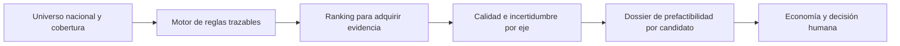

# Auditoría adversarial en tres pasadas para mejorar la clasificación

**Fecha:** 2026-07-10  
**Alcance:** sistema v48, dataset de la aplicación de Sergio y arquitectura de una futura v49.  
**Importante:** v49 es aquí una propuesta de mejora; no se ha entrenado un modelo v49.

## Dictamen ejecutivo

El mayor margen de mejora no está en probar más algoritmos. Está en corregir el
objetivo, el universo evaluado, las etiquetas y la separación entre screening,
prefactibilidad y economía.

El sistema actual es útil para **priorizar revisión dentro de un universo ya
preseleccionado**, pero no es un clasificador nacional de viabilidad ni una
probabilidad calibrada. El framing recomendado es:

> Sistema transparente para priorizar la adquisición de evidencia de
> prefactibilidad.

## Evidencia cuantitativa de partida

| Evidencia | Valor observado | Implicación |
|---|---:|---|
| Celdas v48 | 30.450 | Universo candidato, no malla nacional exhaustiva |
| Área aproximada representada por celdas de 1 km | 30.450 km² | Aproximadamente 6,02% de los 505.410 km² de España en GISCO 20M |
| Padres que generan los hijos de 1 km | 1.218 | Riesgo de preselección y pseudorreplicación |
| Plantas operativas reconciliadas | 24 | Muy pocos positivos y sin negativos reales |
| AP consenso v20 | 0,0153 | Señal de ranking, pero precisión absoluta baja |
| Prevalencia observada | 0,001226 | Lift AP aproximado de 12,5 veces |
| ROC AUC consenso | 0,804 | Puede parecer bueno pese a recuperar pocos positivos |
| Positivos en Top-250 | 4 de 26 | Rendimiento operativo todavía limitado |
| Calibración 1 km | 0 / inexistente | El score no puede interpretarse como probabilidad |
| AP transferencia FR/IT → España | 0,0059–0,0136 | Generalización geográfica débil |
| `feedstock_score` | 17 valores distintos | Proxy demasiado macro para 30.450 celdas |
| `organic_waste_score` | 1.218 valores, repetidos por bloques de 25 | Señal heredada del padre de 5 km |
| `data_completeness` | 1,0 en todas las filas | Mide campos presentes, no completitud de proyecto |
| Veto por nitratos | 15.830 celdas | El 52,0% del universo recibe un veto regulatorio demasiado simplificado |

Fuentes locales: `docs/model_benchmark_v4_metrics.json`,
`docs/biometano_v20_model_quality_audit_metrics.json`,
`docs/biometano_v21_label_quality_audit_metrics.json`,
`docs/biometano_v23_adversarial_model_card_metrics.json`,
`docs/biometano_v48_robust_rerank_metrics.json` y
`sergio_biometano_app/data/provenance_manifest.json`.

### Anomalías de contrato detectadas

- `nearest_operating_biomethane_plant_distance_km` solo está informado en
  1.331 celdas (4,4%) y el único nombre no vacío es `Gunvor`. Debe recalcularse
  nacionalmente o retirarse del contrato; además, cercanía puede significar
  competencia y no idoneidad.
- `natura2000_area_share_1km_v7` vale cero en las 30.450 filas. Es coherente con
  que el universo nació de padres estrictos ya filtrados, pero confirma que la
  capa visual Natura 2000 no equivale a haber evaluado toda España.
- `missing_checks` está vacío y `data_completeness=1` en todas las filas pese a
  que faltan gates críticos. Ambos campos deben cambiar de semántica.

## Pasada 1 — Auditoría estadística y de labels

### Hallazgos críticos

1. **Problema positive-unlabeled:** ausencia de planta conocida no equivale a
   negativo. AP, precisión y calibración quedan contaminadas por falsos
   negativos desconocidos.
2. **Universo condicionado:** las 30.450 celdas nacen de 1.218 padres ya
   seleccionados. El sistema no puede descubrir zonas descartadas antes de la
   expansión a 1 km.
3. **Leakage espacial probable:** hijos vecinos comparten señales parentales.
   Un split aleatorio por fila sería inválido.
4. **Brecha in-sample/transfer:** Random Forest alcanza AP/AUC 1,0 cuando España
   entra en ajuste, pero cae a AP 0,0136 y AUC 0,742 al transferir FR/IT a
   España. No demuestra leakage por sí solo, pero sí sobreajuste o cambio de
   dominio severo.
5. **No existe holdout temporal:** las 24 plantas conocidas solo permiten una
   comprobación de coherencia, no validación independiente.
6. **AUC no es la métrica decisiva:** deben dominar P@25, P@50, P@250,
   recall@K, lift frente a baseline y sus intervalos de confianza.
7. **Linaje inconsistente:** el reranking v48 inicial publica 67 verdes y el
   snapshot final 35. La variante final es válida, pero necesita un identificador
   y hash distinto para evitar comparar artefactos diferentes bajo el mismo nombre.

### Pruebas necesarias

- Gold set independiente y estratificado: al menos 200 candidatos altos y 200
  bajos, con estados `avanza`, `no avanza` y `desconocido` basados en evidencia.
- Cinco folds espaciales externos, agrupando padres y aplicando buffer entre
  entrenamiento y test. Los 50 km propuestos son un punto de partida que debe
  someterse a sensibilidad.
- Holdout temporal prospectivo congelado desde ahora.
- Ablations por familias de variables y estabilidad Top-K.
- Evaluación por CCAA, bioma y distancia al soporte de entrenamiento.

## Pasada 2 — Auditoría industrial, territorial y económica

### Variables de alto impacto todavía ausentes

| Bloque | Variable real necesaria | Fuente abierta inicial | Límite |
|---|---|---|---|
| Sustrato | inventario por explotación, estacionalidad, BMP, MS/VS y contaminantes | SIGPAC, estadísticas MAPA, PRTR | contratos, análisis y disponibilidad son privados |
| Logística | rutas, tonelaje, restricciones y coste puerta-planta | red vial oficial | no incluye precio contractual ni tráfico aceptable |
| Competencia | plantas operativas, proyectos, radio de captación y estado | Enagás, expedientes ambientales | muchos proyectos cambian de estado o no publican sustrato |
| Gas | presión, calidad, punto y capacidad de inyección | operador/titular de red | distancia física no acredita conexión |
| Electricidad | capacidad de demanda, tensión y expediente | REE/distribuidora | la capacidad de demanda de REE no es capacidad gasista |
| Parcela | superficie útil, geometría, construcciones y accesos | Catastro INSPIRE, SIGPAC | PGOU, titularidad y precio requieren consulta local |
| Digestato | balance N/P, suelo receptor, almacenamiento y salida | SIGPAC, reglas autonómicas | acuerdos y plan agronómico son privados/locales |
| Agua | toma, disponibilidad, vertido y sequía | confederaciones, AEMET | exige expediente específico |
| Medio físico | acuíferos, permeabilidad, inundación, geotecnia | IGME, SNCZI | cartografía nacional no sustituye estudio de parcela |
| Receptores | viviendas, hospitales, viento, olor y tráfico pesado | Catastro, AEMET | requiere modelización local y aceptación social |
| Economía | CAPEX, OPEX, terreno, conexión, offtake y sensibilidad | escenarios propios | ofertas y contratos no son open data |

Fuentes oficiales verificadas:

- [SIGPAC y servicio ATOM](https://www.mapa.gob.es/es/cartografia-y-sig/ide/directorio_datos_servicios/agricultura/)
- [Difusión e INSPIRE del Catastro](https://www.sedecatastro.gob.es/Accesos/SECAccDescargaDatos.aspx)
- [PRTR España, residuos 2024](https://prtr-es.miteco.gob.es/informes/descargasResiduos.aspx)
- [Capacidad de acceso de demanda de REE](https://www.ree.es/sites/default/files/12_CLIENTES/Documentos/2026_07_01_GRT_demanda.pdf)
- [Mapa hidrogeológico IGME 1:200.000](https://mapas.igme.es/servicios/wms.aspx?lang=spa&url=https%3A%2F%2Fmapas.igme.es%2Fgis%2Fservices%2FCartografia_Tematica%2FIGME_Hidrogeologico_200%2FMapServer%2FWMSServer%3Fservice%3Dwms__request%3Dgetcapabilities__version%3D1.3.0)
- [AEMET OpenData](https://opendata.aemet.es/dist/)

### Corrección del veto de nitratos

Una zona vulnerable a nitratos obliga a aplicar programas de actuación,
limitaciones de fertilización, almacenamiento y balance de nitrógeno. No
constituye por sí sola una prohibición nacional de ubicar una planta. El Real
Decreto 47/2022 permite incluso demostrar gestión, valorización o eliminación
segura de excedentes. Por tanto:

- pertenecer a zona vulnerable → `digestate_risk = alto` y revisión autonómica;
- prohibición demostrada, imposibilidad de gestionar N/P o falta de receptor →
  veto de prefactibilidad;
- nunca veto automático de ubicación basado únicamente en la geometría ZVN.

Fuente: [Real Decreto 47/2022, artículo 4 y anexo 2](https://boe.es/buscar/doc.php?id=BOE-A-2022-860).

## Pasada 3 — Contraauditoría y descarte de complejidad inútil

### Hacer ahora

1. Corregir el target: priorizar adquisición de evidencia, no predecir
   viabilidad.
2. Construir un universo nacional reproducible. Puede calcularse una malla de
   aproximadamente 500.000 celdas de 1 km, pero conviene rankear primero a 5 km
   y refinar a 1 km para controlar coste GIS y duplicación.
3. Separar vetos demostrados, riesgos, proxies y desconocidos.
4. Sustituir el score único por ejes independientes.
5. Corregir nitratos y completitud.
6. Congelar manifests, hashes, fechas y reglas de selección.
7. Diversificar Top-K para no devolver 25 hijos casi idénticos de un mismo padre.
8. Crear gold set y dossiers de prefactibilidad.
9. Ejecutar ablations contra baselines simples.
10. Empezar el holdout temporal prospectivo.

### Hacer después

- PU learning, nested spatial CV y calibración, cuando exista un target y un
  gold set defendibles.
- OOD formal cuando haya una población de entrenamiento definida.
- CAPEX/OPEX y offtake solo después de verificar sustrato, conexión, parcela y
  digestato.
- Olores, viento, geotecnia y permisos a escala de shortlist/parcela.

### No hacer

- Añadir deep learning, redes neuronales o más árboles para compensar etiquetas
  débiles.
- Elegir un modelo por AUC o métricas in-sample.
- Calibrar probabilidades sobre pseudo-negativos.
- Rellenar datos privados con proxies nacionales y llamarlos verificados.
- Sumar un veto, un proxy y una incertidumbre dentro de un score compensable.

## Arquitectura propuesta

La salida no debe ser una única clase. Debe conservar al menos:

- `legal_physical_gate`: supera / no supera / desconocido;
- `screening_priority`: ranking relativo dentro del universo;
- `evidence_completeness`: vector por dimensión, no un promedio único;
- `execution_risk`: bajo / medio / alto por causa;
- `prefeasibility_status`: no iniciada / en revisión / descartada / prefactible.

## Backlog priorizado

| # | Acción | Impacto | Esfuerzo | Gate de aceptación |
|---|---|---|---|---|
| 1 | Redefinir target, estados y textos | Muy alto | Bajo | 0 afirmaciones de probabilidad o permiso |
| 2 | Corregir regla de nitratos | Muy alto | Bajo | 0 vetos solo por pertenencia ZVN |
| 3 | Manifest inmutable y versión canónica | Muy alto | Bajo | delta 0 entre dataset, app e informes |
| 4 | Universo nacional completo y mapa de cobertura | Muy alto | Medio | 100% del área como evaluada/excluida/desconocida |
| 5 | Colapsar hermanos y diversificar Top-K | Alto | Bajo | máximo un resultado por padre en el Top operativo |
| 6 | Completitud multidimensional con `unknown` | Alto | Bajo | ninguna fila “completa” si falta un gate crítico |
| 7 | Actualizar capacidad y caducidad de infraestructura | Alto | Medio | 100% del shortlist con fuente y fecha |
| 8 | Gold set independiente | Muy alto | Medio | muestra estratificada y acuerdo interrevisor publicado |
| 9 | 25 dossiers de prefactibilidad | Muy alto | Alto | sustrato, conexión, parcela y digestato explícitos |
| 10 | Cuencas logísticas y competencia | Alto | Alto | cada fuente de residuo asignada una vez por escenario |
| 11 | Benchmark prospectivo contra reglas simples | Muy alto | Medio | mejora con IC frente a baseline aleatorio y espacial |
| 12 | Evaluar ML supervisado/PU | Condicional | Alto | nested spatial + temporal + calibración o no despliegue |

## Experimentos que pueden refutar el valor del sistema

1. **Revisión ciega:** comparar el Top-K con controles estratificados. Si no
   aumenta la tasa de avance a prefactibilidad, el ranking no aporta valor.
2. **Validación prospectiva:** congelar v49 y medir outcomes nuevos. Si no supera
   reglas simples de residuo + infraestructura, no justifica ML.
3. **Fragilidad:** retirar cada familia de proxies y variar buffers. Si el Top-K
   cambia sin causa física trazable, el sistema es demasiado inestable.

## Recomendación final

La mejora correcta es una **v49 de arquitectura y evidencia**, no una v49 con un
algoritmo más complejo. Después de corregir universo, target, gold set y gates,
sí tendrá sentido comparar regresión logística regularizada, modelos de boosting
con restricciones y métodos PU bajo validación espacial y temporal.
